### 1. Процесс установки и настройки ufw
#### Установка ufw
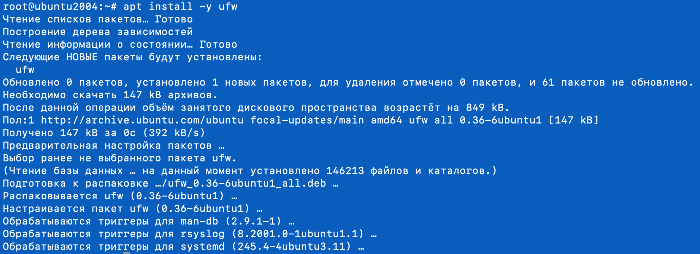

#### Настройка ufw
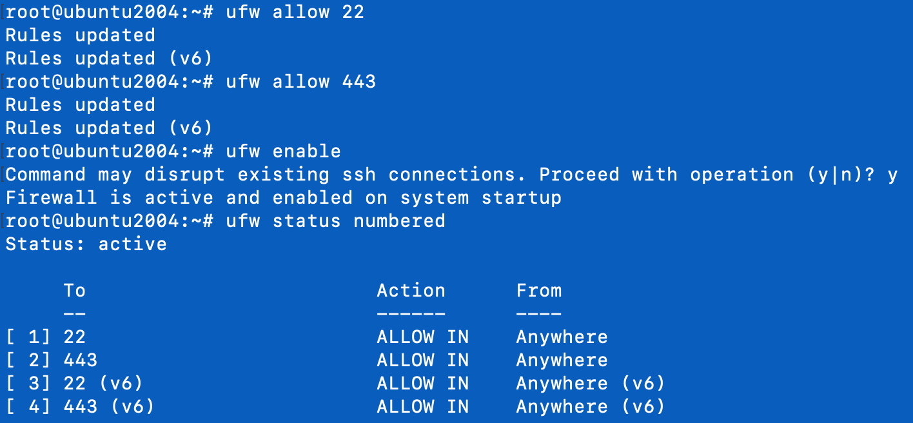


### 2. Процесс установки и выпуска сертификата с помощью hashicorp vault
#### Установка vault
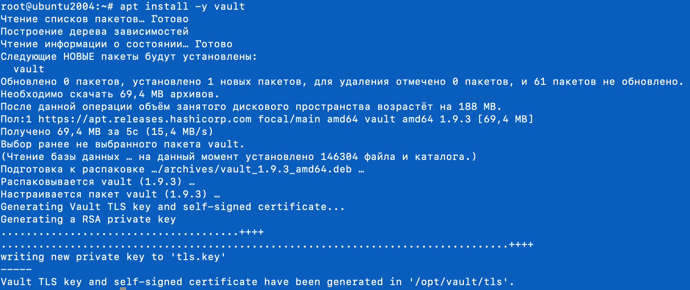

#### Выпуск сертификата
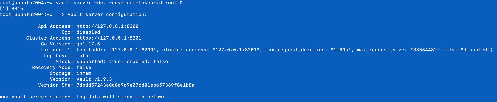
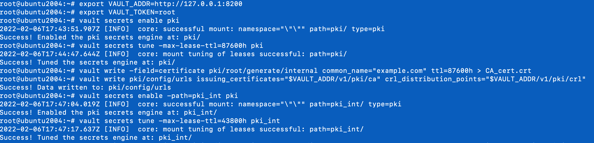
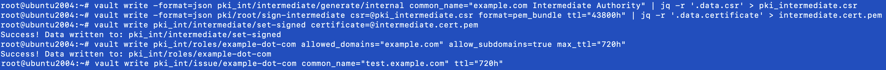

### 3. Процесс установки и настройки сервера nginx
#### Установка nginx
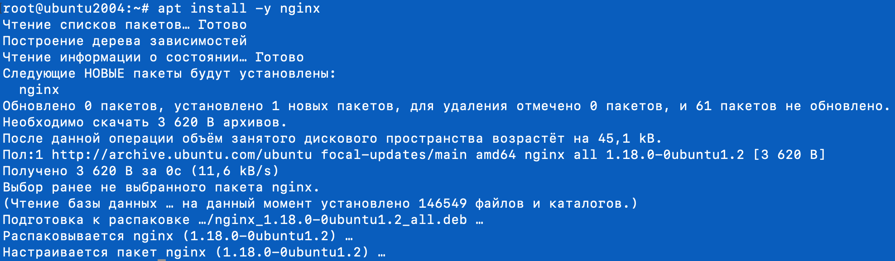

#### Настройкп сервера nginx
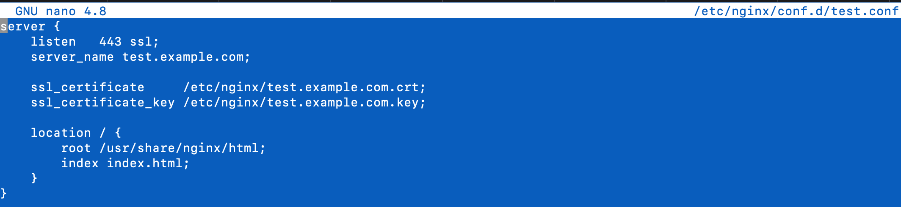

### 4. Страница сервера nginx в браузере хоста не содержит предупреждений
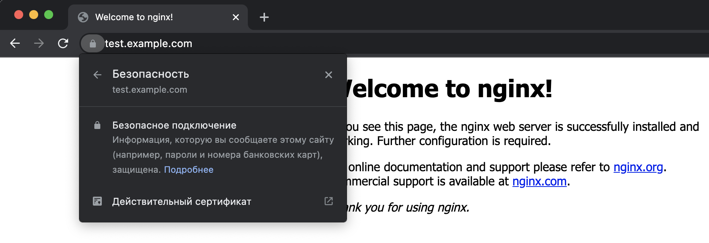

### 5. Скрипт генерации нового сертификата работает
#### Скрипт
```bash
#!/bin/bash

name="test.example.com"
ttl="720h"

if ! netstat -lnp | grep -q 8200 > /dev/null; then
   vault server -dev -dev-root-token-id root &
fi

export VAULT_TOKEN=root
export VAULT_ADDR=http://127.0.0.1:8200

vault write pki_int/issue/example-dot-com common_name="$name" ttl="$ttl" -format=json > /tmp/${name}

cat /tmp/${name} | jq '.data.certificate' | xargs printf > /etc/nginx/${name}.crt
printf "\n" >> /etc/nginx/${name}.crt
cat /tmp/${name} | jq '.data.issuing_ca' | xargs printf >> /etc/nginx/${name}.crt
cat /tmp/${name} | jq '.data.private_key' | xargs printf > /etc/nginx/${name}.key
cat /tmp/${name} | jq '.data.serial_number' | xargs printf > /etc/nginx/${name}.sn # for check

if /usr/sbin/nginx -q -t > /dev/null; then
   /usr/sbin/nginx -s reload
else
   echo $(/usr/sbin/nginx -t)
fi
```
#### Сгенерирован новый сертификат
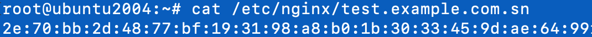

#### Страница сервера nginx в браузере
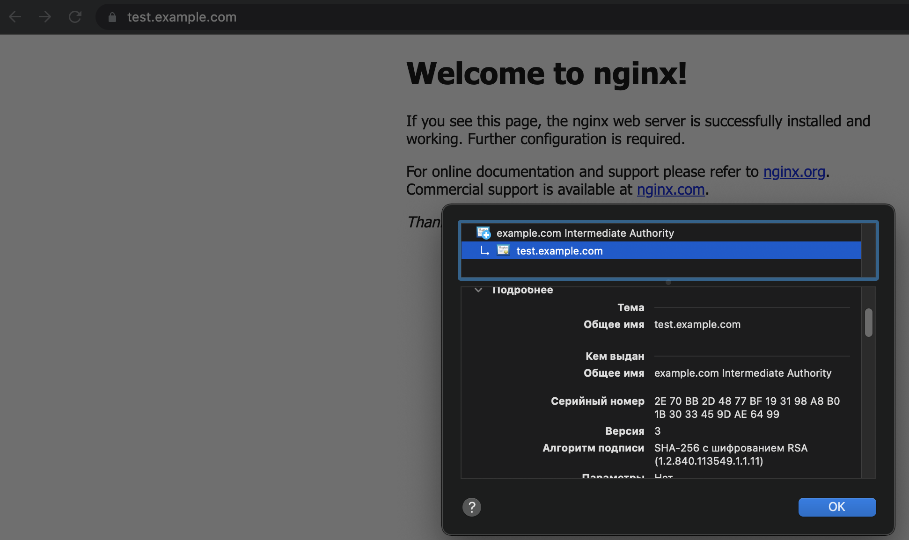

### 6. Crontab работает, выполнение скрипта в полночь каждого 1-го числа
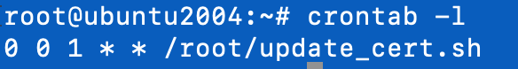


